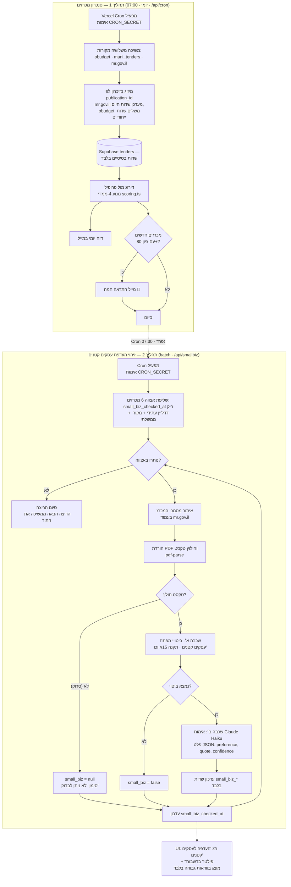

# שווה מכרזים — ארכיטקטורת תהליכי הרקע

> מסמך זה משלים את `תיעוד-Backend-שווה-מכרזים.docx` ומתמקד בשני תהליכי הרקע
> ובהפרדת השדות ביניהם. התרשימים ב-Mermaid (מרונדרים אוטומטית ב-GitHub).

## תרשים זרימה — שני התהליכים



## עקרון מניעת ההתנגשות

| | תהליך 1 (סנכרון) | תהליך 2 (העשרה) |
|---|---|---|
| כותב אל | שדות בסיסיים בלבד (title, dates, status...) | שדות `small_biz_*` בלבד |
| מנגנון | `POST ... resolution=merge-duplicates` — מעדכן רק עמודות שנשלחו | `PATCH /tenders?id=eq.X` נקודתי |
| תוצאה | אינו נוגע בשדות ההעדפה | אינו נוגע בשדות הבסיס |

ה-upsert של PostgREST מעדכן רק את העמודות שמופיעות ב-payload, ולכן הסנכרון היומי
לעולם לא דורס את תוצאות ההעשרה — ולהפך.

## שדות ההעדפה (טבלת tenders)

| שדה | סוג | תיאור |
|---|---|---|
| `small_biz` | boolean (nullable) | true = נמצאה העדפה; false = נבדק ולא נמצאה; null = טרם נבדק / לא ניתן לבדוק |
| `small_biz_summary` | text | סיכום קצר של סעיף ההעדפה |
| `small_biz_quote` | text | ציטוט מדויק מחוברת המכרז |
| `small_biz_confidence` | text | high / medium / low |
| `small_biz_checked_at` | timestamptz | מועד הבדיקה האחרון |

הוספת השדות (הרצה חד-פעמית ב-SQL Editor של Supabase):

```sql
alter table tenders
  add column if not exists small_biz boolean,
  add column if not exists small_biz_summary text,
  add column if not exists small_biz_quote text,
  add column if not exists small_biz_confidence text,
  add column if not exists small_biz_checked_at timestamptz;
```

## שכבות הזיהוי

1. **שכבה א׳ — ביטויי מפתח (חינם):** חיפוש בטקסט המחולץ אחר ביטויים כגון
   "עסק קטן", "עסקים קטנים ובינוניים", "העדפת עסקים", "תקנה 15א".
   אין התאמה → `small_biz=false` בביטחון גבוה.
2. **שכבה ב׳ — אימות LLM (Claude Haiku):** רק כשנמצא ביטוי, קטעי ההקשר
   נשלחים למודל שמחזיר JSON מובנה: האם מדובר בהעדפה אמיתית (ולא, למשל,
   באזכור אגבי), סיכום, ציטוט ורמת ביטחון. ללא `ANTHROPIC_API_KEY` —
   נסיגה לסיווג מבוסס-ביטויים עם `confidence=medium`.

## תזמונים (vercel.json)

| Cron | שעה (IL) | תפקיד |
|---|---|---|
| `/api/cron` | ‎07:00 (חלון עד 08:00) | סנכרון + דירוג + מיילים |
| `/api/smallbiz` | ‎07:30 (חלון עד 08:30) | העשרת אצווה — 6 מכרזים לריצה |

כל ריצת העשרה מטפלת באצווה קטנה בתוך מגבלת ה-serverless (60ש׳);
התור מתקדם מריצה לריצה, מהחדש לישן.
